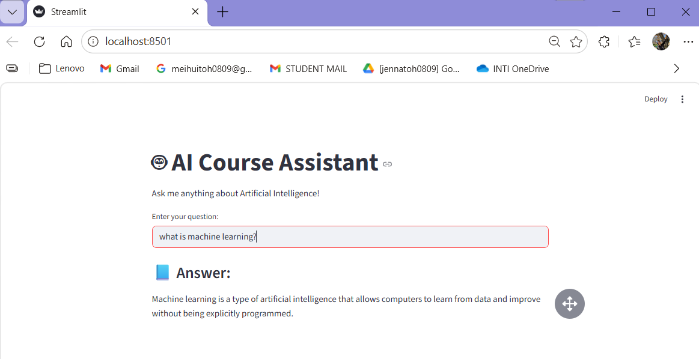

# 🤖 AI Course Assistant Chatbot

## 📌 Problem
Students in AI courses often struggle to understand complex concepts and need quick explanations outside of class.

---

## 👤 User Persona
- University students studying AI  
- Need simple and fast explanations  
- Prefer easy-to-understand answers  

---

## 💡 Solution
This project is an AI Course Assistant Chatbot that helps students understand AI concepts such as machine learning, neural networks, and overfitting.

This project demonstrates the use of a rule-based generative AI simulation to mimic chatbot behavior.

---

## ⚙️ Features
- Answers AI-related questions  
- Simple explanations  
- Interactive chatbot interface  

---

## 🧪 Demo Explanation
This chatbot is a prototype AI assistant designed to help students understand AI concepts.

Due to API quota limitations, responses are simulated using predefined logic.

---

## 📸 Screenshots

### Chatbot Demo

---

## ▶️ How to Run

pip install -r requirements.txt  
streamlit run app.py  

---

## 🎥 Demo Video
(Add your video link here)

---

## ✅ Strengths
- Fast and interactive  
- Easy to use  
- Helpful for beginners  

---

## ⚠️ Limitations
- Not a real AI model  
- Limited responses  
- Depends on predefined logic  
- Easy to use

## ⚠️ Limitations
- May give wrong answers  
